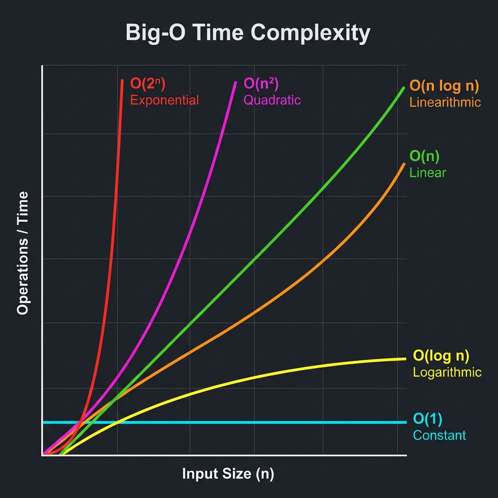

# Complexity Analysis

Complexity analysis is the process of estimating the resource consumption (time and space) of an algorithm.

## 1. Rate of Growth
The **Rate of Growth** describes how the execution time of an algorithm increases as the input size ($n$) grows.

- **Constant Growth**: Time stays the same regardless of $n$.
- **Linear Growth**: Time increases proportionally with $n$.
- **Quadratic Growth**: Time increases proportionally to the square of $n$.

## 2. Asymptotic Notations
Wait we use asymptotic notations to describe the behavior of algorithms as $n$ approaches infinity.

### A. Big-O Notation ($O$) - Upper Bound
It represents the worst-case scenario. It gives the maximum amount of time an algorithm can take.
**Equation**: $f(n) = O(g(n))$ if there exist constants $c > 0$ and $n_0 \ge 0$ such that:
$$0 \le f(n) \le c \cdot g(n) \text{ for all } n \ge n_0$$

### B. Big-Omega Notation ($\Omega$) - Lower Bound
It represents the best-case scenario. It gives the minimum amount of time an algorithm will take.
**Equation**: $f(n) = \Omega(g(n))$ if there exist constants $c > 0$ and $n_0 \ge 0$ such that:
$$0 \le c \cdot g(n) \le f(n) \text{ for all } n \ge n_0$$

### C. Big-Theta Notation ($\Theta$) - Tight Bound
It represents the average-case scenario (or whenever upper and lower bounds are the same).
**Equation**: $f(n) = \Theta(g(n))$ if there exist constants $c_1, c_2 > 0$ and $n_0 \ge 0$ such that:
$$c_1 \cdot g(n) \le f(n) \le c_2 \cdot g(n) \text{ for all } n \ge n_0$$

## 3. Comparison of Common Complexities

| Notation | Name | Example |
| :--- | :--- | :--- |
| $O(1)$ | Constant | Accessing an array element |
| $O(\log n)$ | Logarithmic | Binary Search |
| $O(n)$ | Linear | Linear Search |
| $O(n \log n)$ | Linearithmic | Merge Sort, Quick Sort |
| $O(n^2)$ | Quadratic | Bubble Sort, Nested Loops |
| $O(2^n)$ | Exponential | Recursive Fibonacci |
| $O(n!)$ | Factorial | Generating all permutations |

> [!WARNING]
> Algorithms with $O(2^n)$ or $O(n!)$ complexity are generally unusable for large inputs as they grow incredibly fast.
