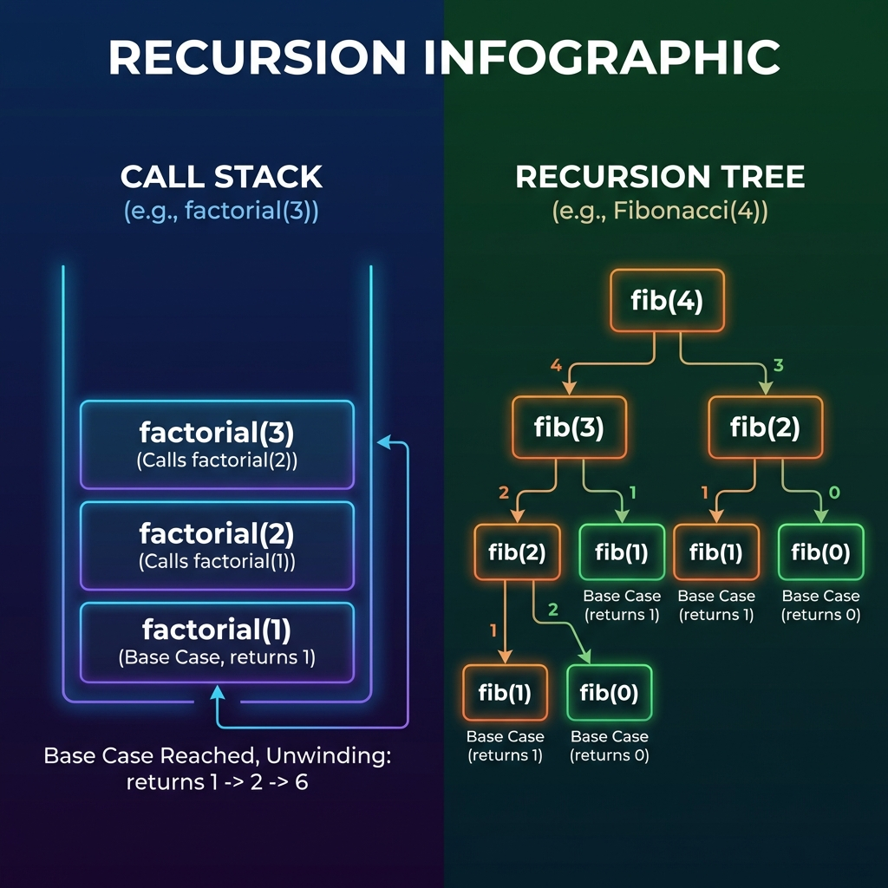

# Recursion Basics

**Recursion** is a programming technique where a function calls itself directly or indirectly to solve a smaller version of the same problem.

## 1. The Anatomy of a Recursive Function
Every recursive function must have two essential parts:

1.  **Base Case (Termination Condition)**: The condition under which the function stops calling itself. Without this, the function will call itself infinitely, leading to a **Stack Overflow**.
2.  **Recursive Step**: The part where the function calls itself with a modified (usually smaller) version of the original input.

### Simple Example: Factorial
```cpp
int factorial(int n) {
    if (n <= 1) return 1; // Base case
    return n * factorial(n - 1); // Recursive step
}
```

## 2. The Call Stack
Recursion relies on the **System Stack** (or Call Stack).
- Each time a function is called, a new **Activation Record** (containing local variables and return address) is pushed onto the stack.
- When the base case is reached, the functions begin to return, and their activation records are popped off the stack.

> [!IMPORTANT]
> Because recursion uses the call stack, it has a hidden space complexity of $O(\text{depth of recursion})$.

## 3. How to Approach a Recursive Problem
1.  **Identify the Base Case**: What is the simplest possible version of this problem?
2.  **Find the Recursive Relation**: How can the problem be broken down into smaller sub-problems of the same type?
3.  **Ensure Progress**: Make sure each recursive call moves closer to the base case.



> [!TIP]
> If you find it hard to visualize, try drawing a **Recursion Tree**.
